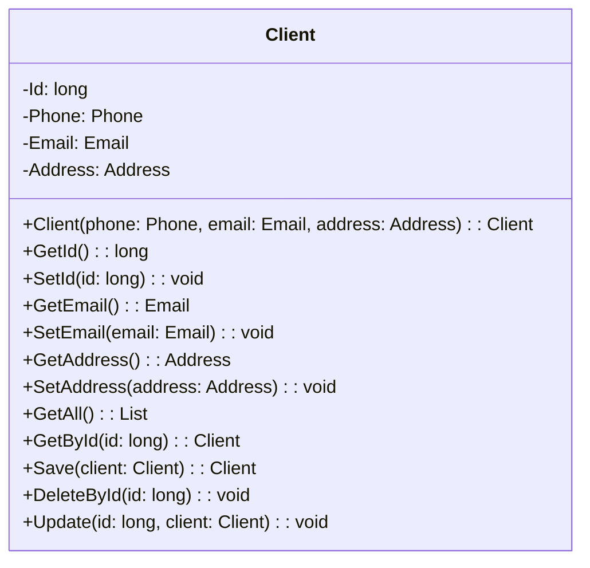
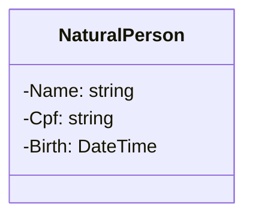
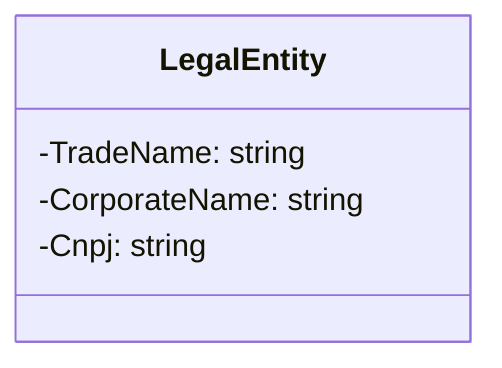
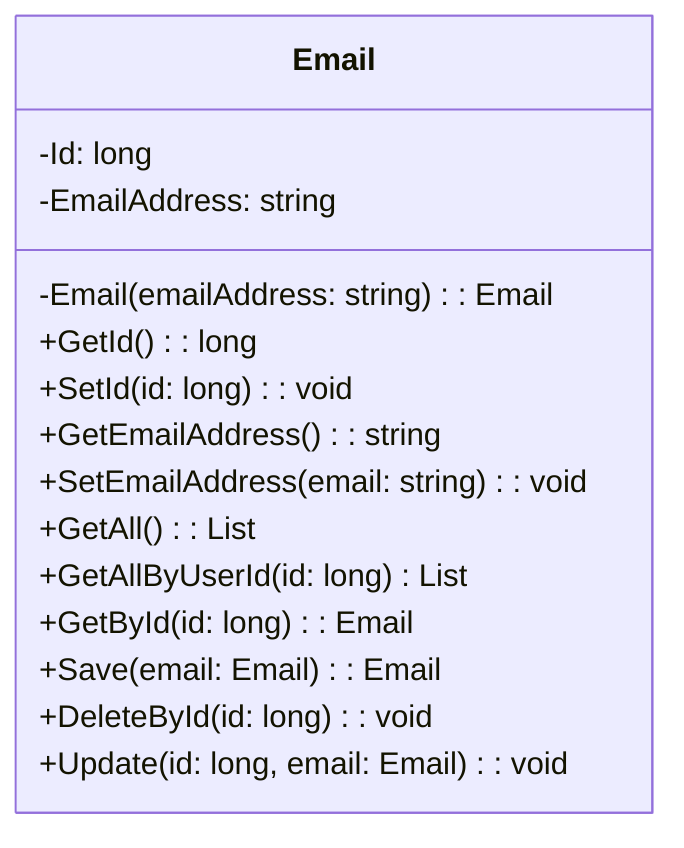
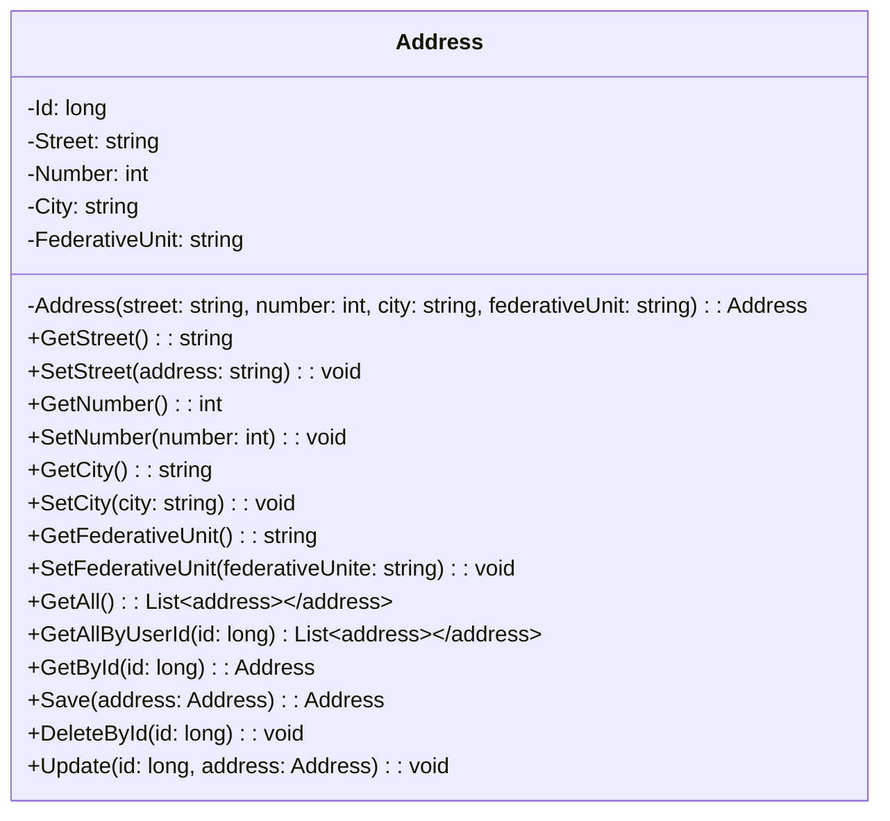
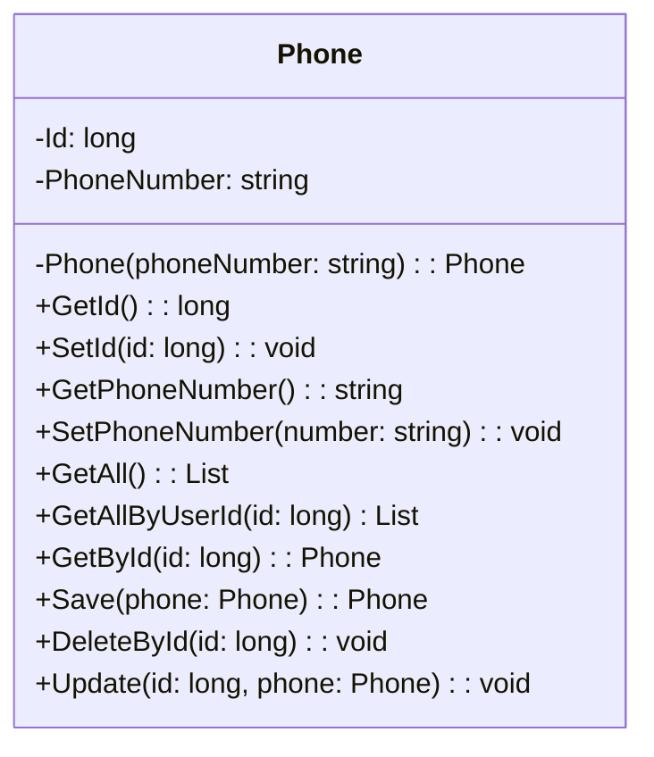
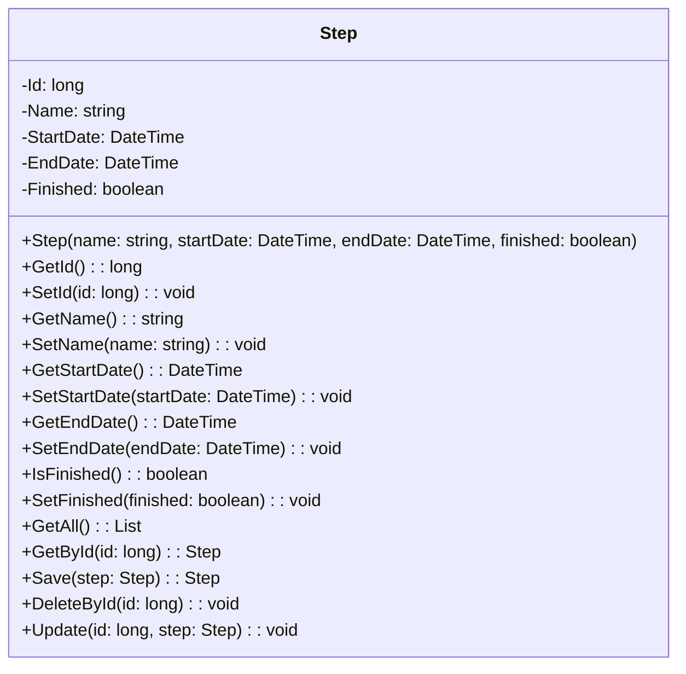
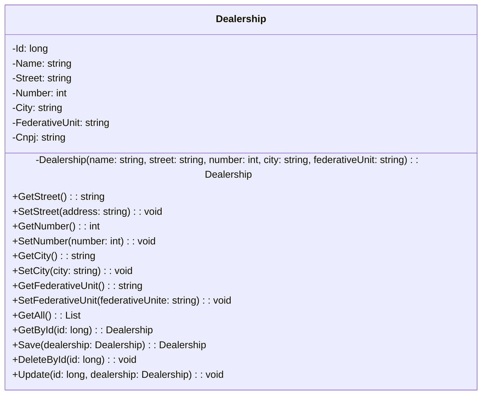
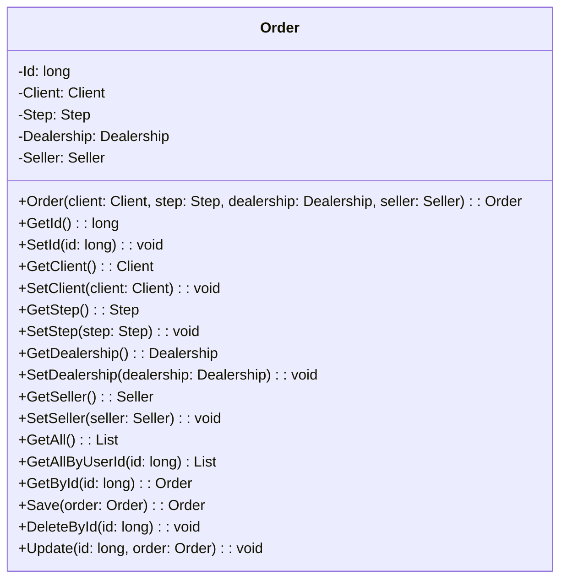

```mermaid
classDiagram
    class Client {
        -Id: long
        -Phone: Phone
        -Email: Email
        -Address: Address
        +Client (phone: Phone, email: Email, address: Address): Client
        +GetId (): long
        +SetId (id: long): void
        +GetEmail (): Email
        +SetEmail (email: Email): void
        +GetAddress (): Address
        +SetAddress (address: Address): void
        +GetAll (): List<Client>
        +GetById (id: long): Client
        +Save (client: Client): Client
        +DeleteById (id: long): void
        +Update (id: long, client: Client): void
    }
```

```mermaid
classDiagram
    class NaturalPerson {
        -Name: string
        -Cpf: string
        -Birth: DateTime
    }
```

```mermaid
classDiagram
    class LegalEntity {
        -TradeName: string
        -CorporateName: string
        -Cnpj: string
    }
```

```mermaid
classDiagram
    class Email {
        -Id: long
        -EmailAddress: string
        -Email (emailAddress: string): Email
        +GetId (): long
        +SetId (id: long): void
        +GetEmailAddress (): string
        +SetEmailAddress (email: string): void
        +GetAll (): List<Email>
        +GetAllByUserId (id: long) List<Email>
        +GetById (id: long): Email
        +Save (email: Email): Email
        +DeleteById (id: long): void
        +Update (id: long, email: Email): void
    }
```

```mermaid
classDiagram
    class Address {
        -Id: long
        -Street: string
        -Number: int
        -City: string
        -FederativeUnit: string
        -Address (street: string, number: int, city: string, federativeUnit: string): Address
        +GetStreet (): string
        +SetStreet (address: string): void
        +GetNumber (): int
        +SetNumber (number: int): void
        +GetCity (): string
        +SetCity (city: string): void
        +GetFederativeUnit (): string
        +SetFederativeUnit (federativeUnite: string): void
        +GetAll (): List<Address>
        +GetAllByUserId (id: long) List<Address>
        +GetById (id: long): Address
        +Save (address: Address): Address
        +DeleteById (id: long): void
        +Update (id: long, address: Address): void
    }
```

```mermaid
classDiagram
    class Phone {
        -Id: long
        -PhoneNumber: string
        -Phone (phoneNumber: string): Phone
        +GetId (): long
        +SetId (id: long): void
        +GetPhoneNumber (): string
        +SetPhoneNumber (number: string): void
        +GetAll (): List<Phone>
        +GetAllByUserId (id: long) List<Phone>
        +GetById (id: long): Phone
        +Save (phone: Phone): Phone
        +DeleteById (id: long): void
        +Update (id: long, phone: Phone): void
    }
```

```mermaid
classDiagram
    class Step {
        -Id: long
        -Name: string
        -StartDate: DateTime
        -EndDate: DateTime
        -Finished: boolean
        +Step (name: string, startDate: DateTime, endDate: DateTime, finished: boolean)
        +GetId (): long
        +SetId (id: long): void
        +GetName (): string
        +SetName (name: string): void
        +GetStartDate (): DateTime
        +SetStartDate (startDate: DateTime): void
        +GetEndDate (): DateTime
        +SetEndDate (endDate: DateTime): void
        +IsFinished (): boolean
        +SetFinished (finished: boolean): void
        +GetAll (): List<Step>
        +GetById (id: long): Step
        +Save (step: Step): Step
        +DeleteById (id: long): void
        +Update (id: long, step: Step): void
    }
```

```mermaid
classDiagram
    class Dealership {
        -Id: long
        -Name: string
        -Street: string
        -Number: int
        -City: string
        -FederativeUnit: string
        -Cnpj: string
        -Dealership (name: string, street: string, number: int, city: string, federativeUnit: string): Dealership
        +GetStreet (): string
        +SetStreet (address: string): void
        +GetNumber (): int
        +SetNumber (number: int): void
        +GetCity (): string
        +SetCity (city: string): void
        +GetFederativeUnit (): string
        +SetFederativeUnit (federativeUnite: string): void
        +GetAll (): List<Dealership>
        +GetById (id: long): Dealership
        +Save (dealership: Dealership): Dealership
        +DeleteById (id: long): void
        +Update (id: long, dealership: Dealership): void
    }
```

```mermaid
classDiagram
    class Order {
        -Id: long
        -Client: Client
        -Step: Step
        -Dealership: Dealership
        -Seller: Seller
        +Order (client: Client, step: Step, dealership: Dealership, seller: Seller): Order
        +GetId (): long
        +SetId (id: long): void
        +GetClient (): Client
        +SetClient (client: Client): void
        +GetStep (): Step
        +SetStep (step: Step): void
        +GetDealership (): Dealership
        +SetDealership (dealership: Dealership): void
        +GetSeller (): Seller
        +SetSeller (seller: Seller): void
        +GetAll (): List<Order>
        +GetAllByUserId (id: long) List<Order>
        +GetById (id: long): Order
        +Save (order: Order): Order
        +DeleteById (id: long): void
        +Update (id: long, order: Order): void
    }
```